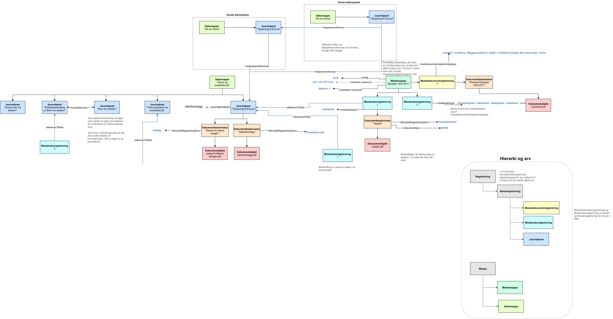

# einnsyn-datamodell

# Skisse

https://drive.google.com/file/d/1rrAva7rtXeUsN4pVKcyTYMPr-QOcXf93/view?usp=sharing

Trykk på "Open with draw.io Diagrams" øverst, når du trykker på lenken over.

Skissen over ble eksportert 26/4/2018, lenken over viser alltid siste versjon av skissen.

# Eksempelfiler
 - Eksempelfil: https://github.com/difi/einnsyn-datamodell/blob/master/moetemappe2-ny-modell.xml
 - Visning av eksempelfil: https://tjenester.oslo.kommune.no/ekstern/einnsyn/moetemappe?id=http%3A%2F%2Fdata.einnsyn.no%2Fnoark5%2Fmoetemappe--MM-12597-BR2--976819837

 - Eksempelfil: https://github.com/difi/einnsyn-datamodell/blob/master/fremtidigmoete1-ny-modell.xml
 - Visning av eksempelfil: https://tjenester.oslo.kommune.no/ekstern/einnsyn/moeteregistrering?id=http%3A%2F%2Fdata.einnsyn.no%2Fnoark5%2Ffremtidigmoeteregistrering--FMR-1800607-1138676--976819853

# Todo
 - lage flere eksempler
 - laste opp JSON-LD
 - laste opp SHACL
